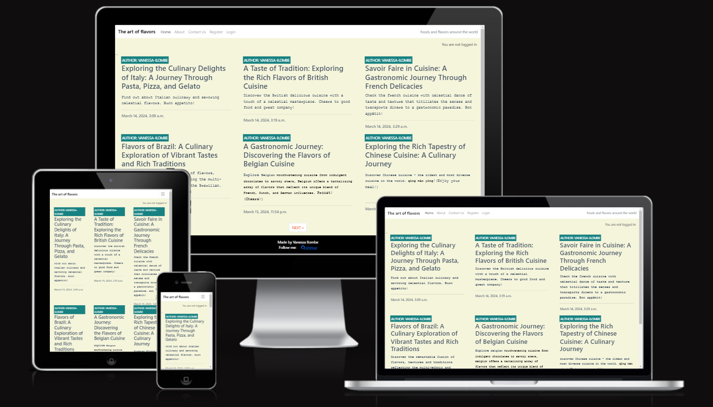
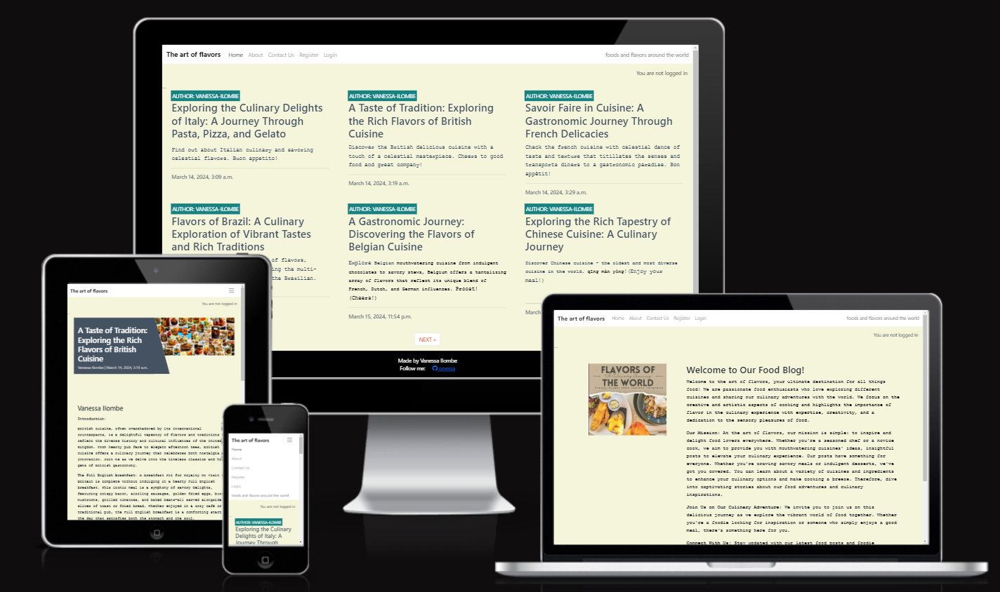
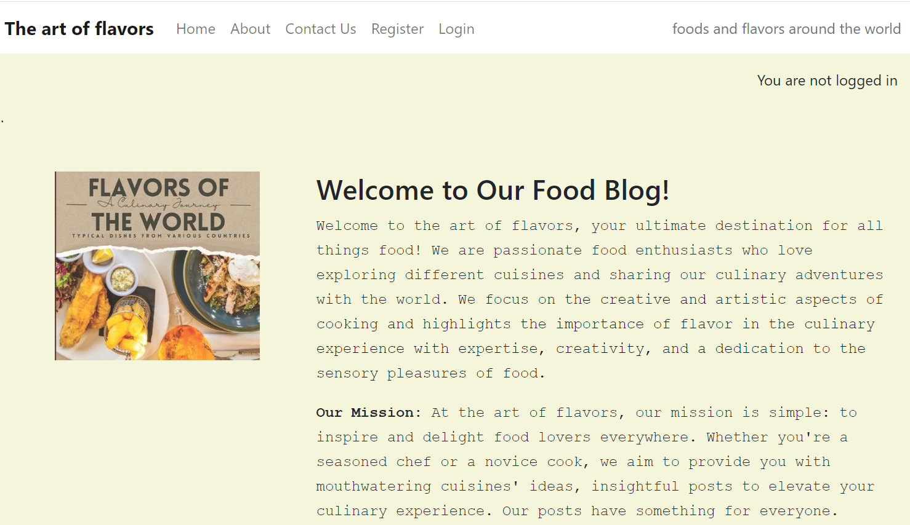

[The art of flavors blog website](https://the-art-of-flavors-58f286867bcb.herokuapp.com/)
### Full-Stack capstone project. Created during the Code Institute Full-Stack developer bootcamp.  







## Overview

The art of flavors blog is a vibrant online platform dedicated to celebrating the art of cooking, exploring diverse cuisines, and inspiring culinary creativity. With a focus on delivering engaging contents, mouthwatering cuisines from a variety of cultures and sharing our culinary adventures with the world. The art of flavors Blog aims to be the go-to destination for food enthusiasts of all skill levels.

User Stories:

The food enthusiasts and pationate readers 

David is a pationate reader who loves to experiment with new flavors and ingredients from around the world. He relies on the art of flavors Blog for unique recipes and culinary insights that broaden his gastronomic horizons, whether he's attempting a traditional Thai curry or a contemporary fusion dish. With easy access to captivating blog contents, David is satisfied with the blog and plan to keep on returning to the blog due to platform responsiveness and great functionality.

The Health-Conscious Cook

Emily prioritizes nutritious eating and seeks cuisines that align with her dietary goals. She trusts the art of flavors Blog for wholesome yet flavorful cuisines' ideas that cater to various dietary options.

The Home Baker

Michael has a passion for baking and is always on the lookout for new dessert recipes to satisfy his sweet tooth. He frequents the art of flavors Bog for cuisines' ideas such as french cusine speciallised with baking. 

The Novice Cook

Emma, a novice cook, is eager to learn about a variety of cusines around the world. She relies on the art of flavors Blog for a choice of different cuisines igniting her interest oin trying other cuisines and learing to cook them.

Conclusion:
Whether you're a seasoned chef or a kitchen novice, The art of flavors Blog is your ultimate culinary companion, offering a different cuisiness and inspiration to enhance your food option journey. Join our community of food lovers today and embark on a flavorful adventure with us!

## UX
### Overview 

The next step was to create user stories with pragmatic success criteria; which were used to create issues that populated the project's kanban board. During the ideation stage, I search for similar websites as guides. After an ideation stage in miror. I had to create the wireframes using balsamic wireframe. Then, I proceeded to building the website.

### Colour Scheme
A color palette that complements the food imagery and evokes the desired mood or atmosphere. Soft, natural tones can create a warm and inviting. Thefore, using beige color on a traditional food blog provide neutral background evoking a sense of warmth, comfort, and familiarity, which aligns well with the idea of traditional cooking and home-style recipes.

- `#F5F5DC' used for primary colour.
- '#FFFFFF' used for secondary colour.


### Typography:

Courier New was used in the admin panel via summernote for good readability and legibility characteristics. Its monospaced design ensures consistent spacing between characters, which can aid in clarity, especially for longer blocks of text for the blog contents. My choice of Courier New was emphasised by it conveying a sense of authenticity or tradition in our content. It might be perceived as a font that harkens back to simpler times or homemade recipes passed down through generations. Moreover, Courier New is used for its branding, and therefore, it may carry over into the blog's typography for consistency across various brand elements enabling to achieve an aesthetic, convey a particular traditional tone and identity of the blog.

These fonts and their sizes were everywhere in the CSS file.

  
```css
{
    /* Font family */

    --ff: courier new

    /* Font sizes */
    --fs: 14
}
```
## User Stories

### Site Users

- As a site user, i want to be able to log into the website to leave a comments on the posts. 
- As a site user, i want to easily access paginated posts  so that i can read them.
- As a site user, i want to able to contact the site admin to ask questions and provide more feedbacks. 

### As a Site Admin

- As a site admin, I want create drafts, posts and provides interesting contents to the site users. 
- As a site admin, I want to highlighting various cuisines options in the world for the readers with the option to leave, edit or delete comments.
- As a site admin, I want to create a contact form for site users to contact the admistration with all the enquires they may have. 
- As a site admin I want to have a clean and intuitive site so that site users's journey is effortless and encourages repeat visits

### Developer 

- As a developer, I want to ensure that the project's code is scalable and adheres to current standards so that future additions are fast to implement.

## Miro Board

The Miro Board was used for iteration allowing me to have a broad picture on the project begging until its ending by adding all the posts, related images and the technologies that will be used.

## Wireframes
To follow best practice, wireframes were developed for mobile, tablet, and desktop sizes.I had focused on designing the wireframes for all pages on desktop first. I then created one wireframe for tablet and one for mobile to provide a guide for placement and spacing. I've used balsamic to design the site's wireframes.

### Mobile Wireframes


### Tablet Wireframes


### Desktop Wireframes


## Features
### Existing Features

- **Navbar**

    - The navbar provides the user with an intuitive navigation method for the site. The desktop navbar is fixed to the top of each page to allow users to always be aware of their location on the site and to have easy access to other areas of the site. Depending on the user's logged in state, the navabr changes to allow users to comment on posts. The navbar in mobile and tablet view is initially hidden and only revealed if the user clicks on the burger icon.


**Contact form**

    - The contact form filled in by the user with their information to send enquires to the site admin. 


- **Login and Register**

    - These two pages allow the user to either register or login in order access the posts and allow them them to leave comments.


 **Home**


  **About**




### Future Features

- Add a review section with star ratings.
- Add a newsletter section.
- Provide healthy eating and diet advice with resources such as articles and videos.

- Chefs and food enthusiasts own management page.
    - Currently the chefs do not have permission to access the admin panel and collaborate with the website admin. The next iteration will include dedicated pages where the chefs can access and manage the admin panel and to be able to create their own blogs with intuitive method to upload or delete images from the blog.

- Payment system

      - Chefs or anyone interested to have permissions to posts their own posts will have to pay before using the service.

## Tools & Technologies Used

- [HTML](https://en.wikipedia.org/wiki/HTML) used for the main site content.
- [CSS](https://en.wikipedia.org/wiki/CSS) used for the main site design and layout.
- [Am i responsive](https://ui.dev/amiresponsive) used for website reponsiveness to ensure that it is functional.
- [JavaScript](https://www.javascript.com) used for user interaction on the site.
- [Python](https://www.python.org) used as the back-end programming language.
- [Git](https://git-scm.com) used for version control. (`git add`, `git commit`, `git push`)
- [GitHub](https://github.com) used for secure online code storage.
- [Gitpod](https://gitpod.io) used as a cloud-based IDE for development.
- [Bootstrap](https://getbootstrap.com) used as the front-end CSS framework for modern responsiveness and pre-built components.
- [Lucid Chart](https://www.lucidchart.com/pages/)for project visualisation.
- [Django](https://www.djangoproject.com) used as the Python framework for the site.
- [ElephantSQL](https://www.elephantsql.com) used as the Postgres database.
- [Heroku](https://www.heroku.com) used for hosting the deployed back-end site.
- [Cloudinary](https://cloudinary.com) used for online static file storage.

## Database Design

- [Lucid Chart](https://www.lucidchart.com/pages/)

Lucid chart was used as a visual map of the platform enabling to visualise the project.

### Entity Relationship Diagrams (ERD)

Entity Relationship Diagrams (ERD) help to visualize database architecture before creating models.
Understanding the relationships between different tables can save time later in the project.

```python
class Contactform(models.Model):
    
    class Contactform(models.Model):
    name = models.CharField(max_length=200)
    email = models.EmailField(max_length=200)
    subject = models.CharField(max_length=200)
    message = models.CharField()
    created_on = models.DateTimeField(auto_now_add=True)
    read = models.BooleanField(default=False)

    def __str__(self):
        return self.subject
```


### Date flowchart 


Flowchart was used to provide a visual representation of the logical flow of the project enabling to understand the structure and sequence of the project.Moreover, it facilitated planning and design before writing code.

## Agile Development Process

### GitHub Projects

[GitHub Projects](https://github.com/qnessa/THE-ART-OF-FLAVORS/projects?query=is%3Aopen)

 Github project was used to add the user Stories and used the project board which served as an Agile tool for this project project creation/issue assignments.

 Through it, user stories, issues, and milestone tasks were planned, then tracked on a weekly basis using the basic Kanban board.

 

[Project board](https://github.com/users/qnessa/projects/3)

 ### GitHub Issues

[GitHub Issues](https://github.com/Johan-Hennius/kit-wagstaff-tattoo/issues) served as an another Agile tool.
There, I used my own **User Story Template** to manage user stories.

It also helped with milestone iterations on a weekly basis.

- [Open Issues](https://github.com/qnessa/THE-ART-OF-FLAVORS/issues)

-

- 

- 

### Unfixed Bugs

site user details are still showing after the form submission. I have suggest refreshing the page afterwads, which help with temporary solving it. 

### MoSCoW Prioritization

I've decomposed my Epics into stories prior to prioritizing and implementing them. Using this approach, I was able to apply the MoSCow prioritization and labels to my user stories within the Issues tab.

Must Have: guaranteed to be delivered (max 100% of stories)

### Testing

- All top level links works as expected.

- User login and logout works as expected.

- User comments have full CRUD functionality.

## Deployment

The live deployed application can be found deployed on [Heroku](https://the-art-of-flavors-58f286867bcb.herokuapp.com/)

### ElephantSQL Database

This project uses [ElephantSQL](https://www.elephantsql.com) for the PostgreSQL Database.

To obtain your own Postgres Database, sign-up with your GitHub account, then follow these steps:

- Click **Create New Instance** to start a new database.
- Provide a name (this is commonly the name of the project: kit-wagstaff-tattoo).
- Select the **Tiny Turtle (Free)** plan.
- You can leave the **Tags** blank.
- Select the **Region** and **Data Center** closest to you.
- Once created, click on the new database name, where you can view the database URL and Password.

### Cloudinary API

This project uses the [Cloudinary API](https://cloudinary.com) to store media assets online, due to the fact that Heroku doesn't persist this type of data.

To obtain your own Cloudinary API key, create an account and log in.

- For *Primary interest*, you can choose *Programmable Media for image and video API*.
- Optional: *edit your assigned cloud name to something more memorable*.
- On your Cloudinary Dashboard, you can copy your **API Environment Variable**.
- Be sure to remove the `CLOUDINARY_URL=` as part of the API **value**; this is the **key**.

### Heroku Deployment

This project uses [Heroku](https://www.heroku.com), a platform as a service (PaaS) that enables developers to build, run, and operate applications entirely in the cloud.

Deployment steps are as follows, after account setup:

- Select **New** in the top-right corner of your Heroku Dashboard, and select **Create new app** from the dropdown menu.
- Your app name must be unique, and then choose a region closest to you (EU or USA), and finally, select **Create App**.
- From the new app **Settings**, click **Reveal Config Vars**, and set your environment variables.

| Key | Value |
| --- | --- |
| `CLOUDINARY_URL` | user's own value |
| `DATABASE_URL` | user's own value |
| `DISABLE_COLLECTSTATIC` | 1 (*this is temporary, and can be removed for the final deployment*) |
| `SECRET_KEY` | user's own value |

Heroku needs two additional files in order to deploy properly.

- requirements.txt
- Procfile

You can install this project's **requirements** (where applicable) using:

- `pip3 install -r requirements.txt`

If you have your own packages that have been installed, then the requirements file needs updated using:

- `pip3 freeze --local > requirements.txt`

The **Procfile** can be created with the following command:

- `echo web: gunicorn app_name.wsgi > Procfile`
- *replace **app_name** with the name of your primary Django app name; the folder where settings.py is located*

For Heroku deployment, follow these steps to connect your own GitHub repository to the newly created app:

Either:

- Select **Automatic Deployment** from the Heroku app.

Or:

- In the Terminal/CLI, connect to Heroku using this command: `heroku login -i`
- Set the remote for Heroku: `heroku git:remote -a app_name` (replace *app_name* with your app name)
- After performing the standard Git `add`, `commit`, and `push` to GitHub, you can now type:
	- `git push heroku main`

The project should now be connected and deployed to Heroku!

### Local Deployment

This project can be cloned or forked in order to make a local copy on your own system.

For either method, you will need to install any applicable packages found within the *requirements.txt* file.

- `pip3 install -r requirements.txt`.

You will need to create a new file called `env.py` at the root-level,
and include the same environment variables listed above from the Heroku deployment steps.

Sample `env.py` file:

```python
import os

os.environ.setdefault("CLOUDINARY_URL", "user's own value")
os.environ.setdefault("DATABASE_URL", "user's own value")
os.environ.setdefault("SECRET_KEY", "user's own value")

# local environment only (do not include these in production/deployment!)
os.environ.setdefault("DEBUG", "True")
```

Once the project is cloned or forked, in order to run it locally, you'll need to follow these steps:

- Start the Django app: `python3 manage.py runserver`
- Stop the app once it's loaded: `CTRL+C` or `⌘+C` (Mac)
- Make any necessary migrations: `python3 manage.py makemigrations`
- Migrate the data to the database: `python3 manage.py migrate`
- Create a superuser: `python3 manage.py createsuperuser`
- Load fixtures (if applicable): `python3 manage.py loaddata file-name.json` (repeat for each file)
- Everything should be ready now, so run the Django app again: `python3 manage.py runserver`

#### Cloning

You can clone the repository by following these steps:

1. Go to the [GitHub repository](https://github.com/Johan-Hennius/kit-wagstaff-tattoo) 
2. Locate the Code button above the list of files and click it 
3. Select if you prefer to clone using HTTPS, SSH, or GitHub CLI and click the copy button to copy the URL to your clipboard
4. Open Git Bash or Terminal
5. Change the current working directory to the one where you want the cloned directory
6. In your IDE Terminal, type the following command to clone my repository:
	- `git clone https://github.com/Johan-Hennius/kit-wagstaff-tattoo.git`
7. Press Enter to create your local clone.

Alternatively, if using Gitpod, you can click below to create your own workspace using this repository.

[](https://gitpod.io/#https://github.com/Johan-Hennius/kit-wagstaff-tattoo)

Please note that in order to directly open the project in Gitpod, you need to have the browser extension installed.
A tutorial on how to do that can be found [here](https://www.gitpod.io/docs/configure/user-settings/browser-extension).

#### Forking

By forking the GitHub Repository, we make a copy of the original repository on our GitHub account to view and/or make changes without affecting the original owner's repository.
You can fork this repository by using the following steps:

1. Log in to GitHub and locate the [GitHub Repository](https://github.com/Johan-Hennius/kit-wagstaff-tattoo)
2. At the top of the Repository (not top of page) just above the "Settings" Button on the menu, locate the "Fork" Button.
3. Once clicked, you should now have a copy of the original repository in your own GitHub account!

## Credits

- [Code Institute](https://codeinstitute.net/) provided guidance and a variety of code snippets for the models, views, templates, and urls.
- [chat.openai](https://chat.openai.com/c/3a5d926f-8859-414a-83c3-6d7d32535fec)
Chatgpt was used to enhance knowledge within this project specifically the blog contents.
-[Johan-Hennius] (https://github.com/Johan-Hennius/kit-wagstaff-tattoo) 
This project was used to improve my README.md content.
-[istock photo](https://www.istockphoto.com/search/2/image) Images used where taken from istock photo.
### Content
| Source | Location | Notes |
| --- | --- | --- |
| [Markdown Builder](https://tim.2bn.dev/markdown-builder) | README and TESTING | tool to help generate the Markdown files |
| [Stack Overflow](https://stackoverflow.com/) | entire site | general advice on most parts of the site |
| [W3Schools](https://www.w3schools.com/) | entire site | general advice on most parts of the site |

### Acknowledgements

- I would like to thank our facilitator David Calikes for his support as I am immensely grateful for is encouragement as he is the reason why I did not drop out during the course with personal issues that could have adversly impact on my conitnuation on the course. David Calikes reminded me that I have the ability to finish the course and do better. So, thank you again David. I will also like to thank our coding coaches Kevin and Martin at the Code institute for there exceptional guidance.
- I would like to thank my Code Institute mentor, Chris Quinn for his tim, guidance and support throughout the development of this project. You are a great mentor.
- I would like to thank the [Code Institute](https://codeinstitute.net) tutor team for their assistance with troubleshooting and debugging some project issues.
- I would like to thank the [Code Institute Slack community](https://code-institute-room.slack.com) for the moral support; it kept me going during periods of self doubt and imposter syndrome.
- The blog project designed by code institute was used to help design the Django framework and provided some coding snippets.

